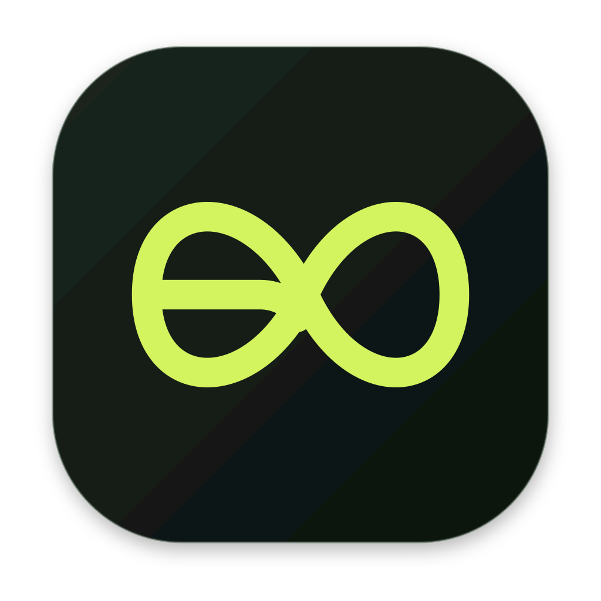

<div align="center">
  

# Goalong History

**Private, verifiable activity for macOS.**

A native menu-bar app that turns foreground activity into a clear local timeline, seals it against later rewriting, and lets the user disclose only what they choose.

[Install the audited source build](#build-from-source) · [Guide français](GUIDE_FR.md) · [Security model](SECURITY.md)
</div>

> **Agent Activity privacy notice:** the currently published `latest-main` bundle predates
> direct-source indexing. Do not install that bundle. From this checkout, use
> `./install.sh --source`; the installer builds, audits, stages, and validates the
> direct-source app before replacing an existing installation.

> Goalong History is for a Mac you own and use yourself. Never use it to monitor another person without their prior, explicit consent.

## A Mac installation that feels like a product

The current public `latest-main` artifact is intentionally rejected by the installer because it
predates the direct-source Agent Activity privacy boundary. Until a replacement release is
published, build and install this checkout with `./install.sh --source`. That workflow runs the
tests and privacy audit, builds the app for the current Mac architecture, validates its identity and direct-source marker,
then replaces an existing installation atomically with rollback on failure.

After installation, open **Goalong History** and follow the native setup assistant. The app is
compatible with macOS 13 Ventura or later. A source build automatically uses an available Apple
Development identity for stable local permissions; without one it warns and falls back to ad-hoc signing.

The first launch guides the user through five focused screens:

1. what Goalong History does;
2. the exact privacy boundary;
3. Accessibility, explained and requested in context;
4. Input Monitoring, explained and requested separately;
5. a final health check and an explicit “start at login” choice.

The installed app also provides a read-only `goalong` terminal command for users and local agents. It exposes Computer History, detailed Apple Screen Time, available dates, daily recaps, and bounded agent context as JSON without creating a second history store or background process. See [`docs/CLI.md`](docs/CLI.md).

Permission state updates live. Every step includes a direct System Settings route and a safe “set up later” path, so the user is never stranded.

## What the app records

When the relevant macOS permissions are granted, Goalong History can store:

- the active app and bundle identifier;
- active window title and accessible control metadata;
- a cleaned browser URL where available and allowed;
- clicks and grouped scroll activity;
- shortcuts and navigation keys;
- typing count and duration, **never the characters**;
- app, window, focus, lock, sleep, pause, and suppression transitions;
- limited Core Graphics input-origin signals.

It does **not** record screenshots, screen video, camera, microphone, system audio, clipboard contents, passwords, or reconstructed typed text.

Recognized and capability-detected private-browser windows are fail-closed. The record keeps a generic private/suppressed coverage state without storing the private URL, window title, click details, or keyboard activity. Browser URL availability still depends on the Accessibility information exposed by that browser; an extension may be needed for browsers that do not expose it. Password managers and secure text-entry contexts are excluded or suppressed as well.

## Local-first by default

Detailed activity is written to the current user’s private Application Support directory.
This abridged tree includes the principal preserved data stores:

```text
~/Library/Application Support/LocalHistory/
├── config.json
├── sharing-rules.json
├── integrity-state.json
├── diagnostics.log
├── events/
│   └── YYYY-MM-DD.jsonl
├── seals/
│   └── YYYY-MM-DD.seals.jsonl
├── receipts/
│   └── YYYY-MM-DD.receipts.jsonl
├── semantic/
├── analysis/
├── memories/
├── computer-history/
├── apple-screen-time/
├── agent-activity-v2/
└── shares/
```

Directories use mode `0700`; detailed files use mode `0600`.

Verification networking is disabled by default. When the user enables it, the only live upload is an opaque minute commitment. App names, URLs, window titles, clicks, categories, event roots, event counts, and local event timestamps are not included in that upload.

## Verifiable without forcing disclosure

Each event is separated into independently committed groups:

```text
time · application · website · context · activity · classification · coverage · trust · raw_digest
```

Each group receives a random 256-bit salt and SHA-256 commitment. Those commitments form an event Merkle root. Event roots are chained with a monotonic sequence and the previous event hash.

Once per minute, event roots are committed into a minute Merkle root. The minute anchor is chained to the previous anchor and signed with a P-256 device key. Goalong History first tries Secure Enclave through the modern Data Protection Keychain and falls back to a non-exportable Keychain key for a stable Developer ID build. Ad-hoc builds, including the current rolling release, use a user-only local key file and report that lower trust tier instead of creating a Keychain item that would trigger password prompts after recompilation.

Signing identities are scoped to the app's designated code-signing requirement. If that requirement changes, Goalong History records a visible identity rotation and keeps the existing chain data instead of repeatedly requesting access to an incompatible old key. A refused authentication attempt also suspends background signing for that launch, so it can never create a password dialog every minute.

The contextual **Share day** action stores one rule for every observed application and website:

- show the app or website name;
- show only its category;
- hide its identifying details.

Website rules take priority over the containing browser rule. The original JSONL is never rewritten. Export creates a separate `*.verified-share.json` package containing only the selected event-level openings and the hashes required to reconstruct the already-sealed roots. Every sealed minute remains represented, so anonymization cannot silently turn into omission.

## Native dashboard

The SwiftUI dashboard exposes only three primary destinations:

- **Today** — runtime state, daily metrics, top applications, coverage and the optional
  five-line GPT-5.6 Luna High assessment;
- **History** — one selected-day view with an all-sources timeline and filters for causal
  [Computer History](docs/COMPUTER_HISTORY_PARITY.md), Apple Screen Time and
  [AI conversations](Features/AgentActivity/README.md);
- **Settings** — ChatGPT connection and a short progressive-disclosure list for recording,
  sources, privacy, permissions and expert controls.

Sharing is a contextual **Share day** action on Today and History. Privacy, source management,
verification and detailed capture options remain available without occupying permanent sidebar
destinations.

A menu-bar control keeps pause/resume, status, dashboard access, and sharing immediately available.

## Updates and start at login

Start-at-login is an explicit onboarding choice implemented with Apple’s `SMAppService`. Goalong History no longer installs a hand-written LaunchAgent. Upgrading preserves the local history and settings directory.

A legacy LaunchAgent from versions before 0.4 is removed automatically by the installer. The current audited source build deliberately disables in-app updates so it cannot consume the older public Agent Activity bundle. Update controls can be enabled again only in a compatible Sparkle release that carries the direct-source privacy marker and passes the installer’s identity, signature, checksum, and update-policy checks.

## Build from source

Source installation is intentionally a developer path, not the public onboarding path.

Requirements:

- macOS 13 or later;
- Xcode Command Line Tools.

```bash
git clone https://github.com/blancmathis/goalong-history.git
cd goalong-history
./install.sh --source
```

Or run the individual quality gates:

```bash
swift test
./scripts/audit_privacy_boundaries.sh
LOCALHISTORY_ARCHS="$(uname -m)" ./scripts/build_app.sh
```

Useful Make targets:

```bash
make test
make audit
make app
make dmg
make install-source
```

The build script creates a real `.app` bundle, generates the `.icns` asset, writes the release Info.plist, code signs the bundle, and verifies it. Local builds automatically use a stable Apple Development identity when available. Public rolling builds require Developer ID, Hardened Runtime, notarization, and a separate Sparkle EdDSA signature.

## Release pipeline

Every successful merge to `main` attempts to increment the last published visible patch version (`0.5.1` → `0.5.2` → `0.5.3`), build both architectures, create the universal binary, verify the Sparkle configuration, create the branded DMG and ZIP, sign the update archive and feed with EdDSA, and replace the `latest-main` prerelease. Publication fails closed unless Developer ID signing and notarization credentials are complete. The repository [`VERSION`](VERSION) file can request a larger next version such as `0.6.0`; automatic patch increments continue from there. Sparkle keeps a separate monotonic `5000.x.y` build number for update ordering. The separate stable-tag workflow remains reserved for explicit stable releases.

Release credentials and the exact process are documented in [`docs/RELEASING.md`](docs/RELEASING.md). Installation design principles are documented in [`docs/INSTALLATION_UX.md`](docs/INSTALLATION_UX.md).

## Reference verification server

The included backend is deliberately a reference implementation:

```bash
cd server_reference
python3 -m venv .venv
source .venv/bin/activate
pip install -r requirements.txt
uvicorn app:app --host 127.0.0.1 --port 8787
```

Then enable opaque minute commitments under **Settings → Anti-tamper verification** and use:

```text
http://127.0.0.1:8787
```

HTTP is accepted only for localhost development. Use authenticated accounts, HTTPS, rate limits, challenge expiry, append-only or audited anchor storage, and a production App Attest verifier before presenting activity as platform-verified.

## Honest trust boundary

The defensible claim is:

> The official client observed and committed these data at those times; the disclosed fields match the live anchors and were not rewritten later.

It is not proof of a person’s identity, internal attention, or intellectual effort. Hardware HID emulation, another person at the keyboard, remote hardware, and a compromised operating system remain fundamental limits.

## License

MIT. See [`LICENSE`](LICENSE).
