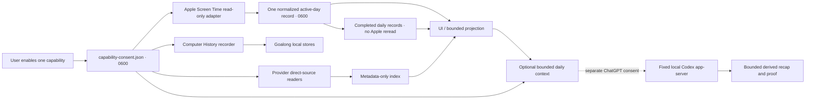
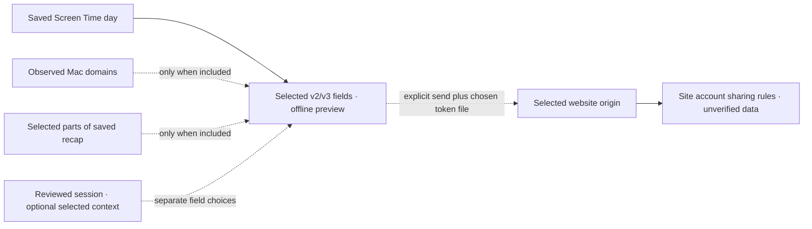

---
context_room:
  id: assurance.security.data-flow
---

# Data flow

The optional website path reads these saved sources only after the user selects the day and
details. It has a separate explicit send boundary:

No Apple Screen Time database or conversation body is copied into Goalong storage. Goalong keeps
one normalized Screen Time record per observed day: only today's record is updated from Apple;
completed days are served locally and never cause a retrospective Apple read. The CLI reaches the
running app through a `0700` runtime directory and `0600` Unix socket only when the active day must
be refreshed. Completed-day CLI reads open the owner-only daily record directly and create no
response file. If Screen Time consent is off, active-day refresh is unavailable.

The Codex edge is the optional external-analysis boundary; the website edge submits selected data
without starting a new analysis. Neither the offline preview nor continuous capture triggers a
website send. Full provider transcripts and event journals are not website payload inputs. A contextual session may include explicitly selected bounded excerpts of captured context; those excerpts can contain personal text and have their own transmission control.
[`PRIVACY.md`](PRIVACY.md#website-disclosure) owns the disclosure rules and
[`NETWORK.md`](NETWORK.md) owns transport controls. The retired commitment uploader, App Attest
transport and updater remain excluded. Full Disk Access reader isolation remains not shipped.
