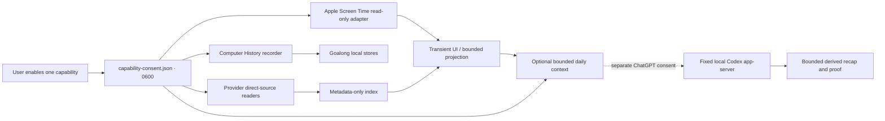

---
context_room:
  id: assurance.security.data-flow
---

# Data flow

No Screen Time database or conversation body is copied into Goalong storage. The CLI’s Screen
Time command reaches the running app through a `0700` runtime directory and `0600` Unix socket;
the response is transient. If Screen Time consent is off, the socket is absent and the CLI fails
clearly.

The dotted Codex edge is the sole intentional external-analysis boundary. The shipped app has no
first-party HTTP uploader or updater. Full Disk Access reader isolation remains not shipped.
