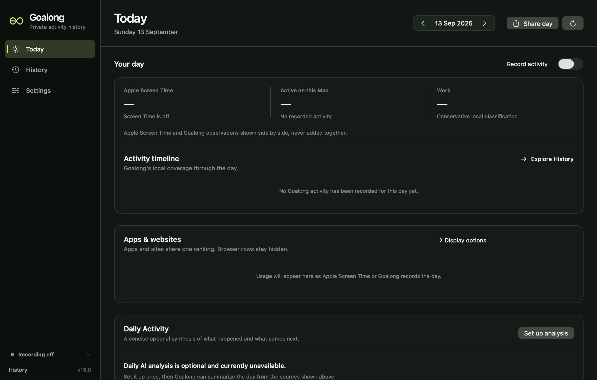
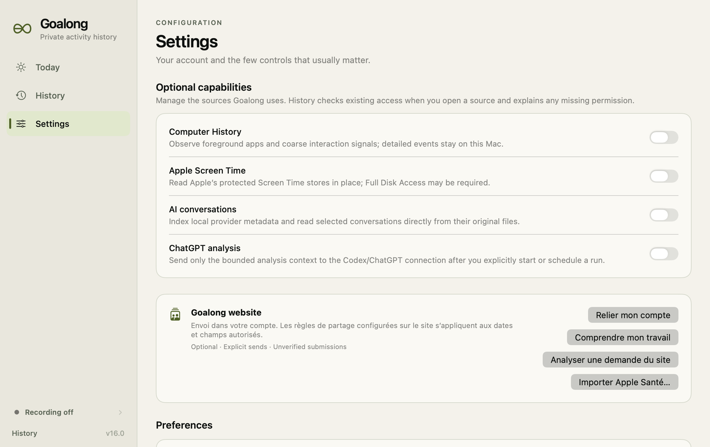

# Goalong History — native brand review

These are actual renders of the application's SwiftUI views, not generated mockups.
They use empty stores in an isolated home, with data sources disabled. No installed
application or real history was used. The footer version belongs to the XCTest
host and is **not** an application release identifier.

## Main surfaces

| Surface | Dark | Light |
|---|---|---|
| Today | [View](today-dark.png) | [View](today-light.png) |
| History | [View](history-dark.png) | [View](history-light.png) |
| Settings | [View](settings-dark.png) | [View](settings-light.png) |
| Privacy | [View](privacy-dark.png) | [View](privacy-light.png) |
| CLI | [View](cli-dark.png) | [View](cli-light.png) |
| Sources | [View](sources-dark.png) | [View](sources-light.png) |

The main matrix is 1240 × 790 logical points. Retina captures are twice that size.

## Layout and state checks

[Minimum window, dark](settings-dark-1080.png) ·
[Minimum window, light](settings-light-1080.png) ·
[Large window](settings-dark-1600.png) ·
[Accessibility appearance](settings-increased-contrast.png) ·
[Unsaved settings](settings-unsaved-dark-1080.png)

[Onboarding: welcome](onboarding-step-0-dark-1080.png) ·
[Onboarding: sources](onboarding-step-1-dark-1080.png) ·
[Onboarding: ready](onboarding-step-2-dark-1080.png)

Minimum is 1080 × 680 points; large is 1600 × 1000. The accessibility-appearance
capture is not a full system Increase Contrast or VoiceOver audit.

## Distribution assets

[App icon](../../Distribution/AppIcon.png) · [Installer background](../../Distribution/DMGBackground.png)

## Preview

## Verification boundaries

The renderer asserts image generation, onboarding dimensions and the existing
model's save/discard and section-selection behavior. It does not assert physical
clicks, keyboard traversal or connected-account behavior. Native accessibility
activation was attempted but the XCTest host exposed no SwiftUI descendants.
The exported gallery has not had a complete manual visual review.

Run `scripts/verify_brand_ui.sh` to regenerate. Full verification results and the
unresolved scanner-load test failure are in
[the audit](../../docs/BRAND_ALIGNMENT_AUDIT.md).
